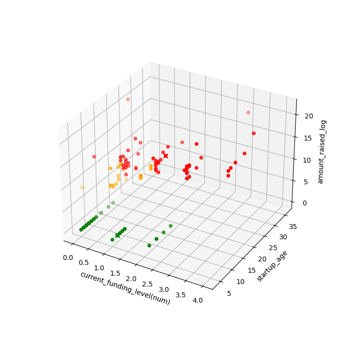

# INTRODUCTION

While I was surfing the Web, I faced with a quite catchy website, which looks pretty cozy at the same time. The website is a collection of today space startups and the information about them. So, I decided to use scrapping data tools to collect it for the future analysis.

The report immerses to an explanatory data analysis using applying various statistic methods. After that an additional analysis comes with implementing K-Means clustering on the data and extracting insights about space startups' countries and industires.

The project tasks were set:
1. Collect the data
2. Structure the data
3. Implement an explanatory data analysis
4. Implement KMeans clustering on the data
5. Extract additional insights.

The main tools are used:
- Python - programming language
- Requests - sending HTTP requests to interact with a website
- BeatifulSoap - scrapping data from webpages.
- Pandas - data manipulating and analysis
- Numpy - working with arrays.
- Matplotlib and Seaborn - visualizing
- VSCode - IDE
- Git - version control

I found it exciting to collect the space startups' information and make the data analysis to reveal insights in the area, where I have got few knowledge.

Additionaly, the Power BI report was created to provide a quick and convenient overview of space startups - [Power BI report](bi_report.pbix).

# RESEARCH

## 1. DATA
### 1.1. Data Description
The space startups data is collected from https://www.spacebandits.io/. The web site contains the basic information about startups:
- Startup name
- Country
- Industry
- Year founded
- Number of employees
- Current funding level
- Amount raised
- Startup description

All this information is collected with data scraping.

### 1.2. Data Scrapping

The data scraping is primarily performed using the BeatifulSoup and Requests libraries. 
The code is implemented with a single module [data scraping](/implementation/data_scraping/data_scraping.py/). It consists of a main function and supporting functions for parsing an url and extracting an information / url.

The logging library is used to check implementation errors and monitor the execution flow. Unittests were also created for the functions in [data scrapping unittests](/tests/test_data_scrapping.py/)

The data is structured as a list of dictionaries and subsequently converted to a JSON file - [json data format](/assets/data/startups_data.json/).

## 2. ANALYSIS
## 2.1. Exploratory Data Analysis
### 2.1.1. Preliminary data explanation, manipulating and cleaning
The initial data had 130 rows and 7 columns.

During preliminary exploration, it is found out, that the industry column contains a missing value specifically for the startup NewRocket. As the website lacks the industry information information, the Launch industry is manually assigned based on the starup's description.

The dataset echibits the following unique categorical and numerical features:
- 11 unique industries (categorical)
- 21 unique countries (categorical)
- 20 unique founding years (categorical)
- 6 unique employee number categories (categorical)
- 5 unique funding level categories (categorical)
- 70 unique raised amount values (numerical)

Subsequently, the column names are standartized. The startups description column is removed as it is deemed unnecessary for the main analysis. The data types of certain columns are also adjusted.

The new columns are created:
- startup_age - calculated from year founded
- startup_size - according to employees number categories:
    - 1-10 - Very Small
    - 11-50 - Small
    - 51-200 - Medium
    - 201-500 - Large
    - 501-1000 - Very Large
    - 1000+ - Enterprise

The founding years of the space startups range is from 1989 to 2021. The oldest startup is 35 years old, and the youngest - 3. The raised amounts range is from $0 to $3 000 000 000. The average raised amount is $71,5 million, with a standart deviation of $370 636 877, indicating high variability.

### 2.1.2. Univariate analysis

The distribution and skewness in the numerical data are explored using histograms and boxplots.

**Picture 1. Year founded data distribution and skewness.**

Active development of space startups began around 2005, with a significant boom observed between 2013 and 2020(Picture 1).

**Picture 2. Startups age data distribution and skewness.**

Few space startups are more than 15 years old (Picture 2). Most are betwiin 5 and 12 years old. The data exhibits left skewness with a few outliers aged 20 to 35 years.

_skew.png)

**Picture 3. Raised amounts (USD) data distribution and skewness.**

The overwhelming majority of space startups have a raised amount of $0, with considerably fewer having raised amounts close to zero - between $0 and $200 million (Picture 3). There are three outliers with raised amounts between $1 billion and $3 billion.

The raised amount data distribution is normalized by converting to logarithms (Picture 4)

**Picture 4. Raised amounts log distribution**

For exploring the categorical data countplots are used (Picture 5).

**Picture 5. Univariate observation of categorical data**

Univariate analysis of the categorical data reveals the following:

- The most active space startups industry is Satellites, wtih approximately 40 startups, followed by Launch with around 26.
- The USA leads in the number of space startups with over 70, followed by the UK with approximately 14.
- Most space startups are very small or small, with 1-10 and 10-20 employees. There are also over 15 large startups with 51-200 employees. 
- Space startups are primarily at the Seed or Self-founded funding level, with the frequency decreasing for each subsequent funding level.

### 2.1.3. Bivariate analysis

A pair plot is used to perform the bivariate analysis of the numerical data (Picture 6). The log-normalized data of raised amounts is used in this analysis.

**Picture 6. Bivariate observation of numerical data**

Startup age exhibits a positive correlation with raised amount. Therefore, founding year shows a negative correlation with raised amount.

Barplots are used to perform the bivariate analysis of the categorical data (Picture 7). The numerical data is represented in mean values in this analysis.

**Picture 7. Bivariate observation of categorical data**

On average:
- The Rovers industry has the oldest space startups and highest average raised amounts. 
- Japan has the oldest average space startups. 
- Using log-normalized raised amounts, The highest average raised amounts are observed in China, Japan, and Finland. However, using the raw USD raised amounts, the leaders are USA, China and Japan.
- Enterprise-sized startups (1000+ employees) hasve the oldest average age and the highest average raised amounts.
- Startups at the Series C+ funding level have the oldest average age and the highest raised amounts.

### 2.1.4 Multivariate analysis

To implement the multivariate analysis the new columns are created - startup_size(num) (1-6) and current_funding_level(num) (0-4) (Table 1 & 2). The columns' values are converted to numerical data. 

For multivariate analysis, the categorical columns startup_size and current_funding_level are converted to numerical representations. startup_size(num) is created, mapping "Very Small" to 1, "Small" to 2, and so on up to "Enterprise" as 6. Similarly, current_funding_level(num) is created, mapping "Self-funded" to 1, "Seed" to 2, and so on upt ot "Series C+" as 5. (See Table 1 and 2)

**Table 1.** Converting size to numerical data.
| Size       | Numerical |
|------------|-----------|
| Very Small | 1         |
| Small      | 2         |
| Medium     | 3         |
| Large      | 4         |
| Very Large | 5         |
| Enterprise | 6         |

**Table 2.** Converting funding level to numberical data.
| Funding level | Numerical |
|---------------|-----------|
| Self-funded   | 0         |
| Seed          | 1         |
| Series A      | 2         |
| Series B      | 3         |
| Series C+     | 4         |

All the original categorical data columns are removed for this analysis. amount_raised(usd) column is dropped as well in favor of the log-normilized version. A heatmap is used for the multivariate analysys  (Picture 7).

**Picture 8. Multivariate obseravation, heatmap**

The heatmap reveals the following correlation coefficients:
- Current funding level has a strong positive correlation with startup size (0.63) and raised amount (0.7). It aslo has a moderate positive correlation to startup age (0.36)
- Startup size has a strong postivie correlation with startup age (0.54), raised amount (0.59) and current funding level (0.63).
- Startup age has a moderate positive correlation with raised amount (0.49) and current funding level (0.36)

## 2.2. K-Means Clustering

The K-Means clustering algorithm is implemented iodentify identify distinct groups or patterns within the data. To avoid redudancy and capture more diverse patterns, variables with relatively lower correlation coefficients are preffered for K-Means clustering. Based on the multivariate analysis, the following combinations are used:
1. current funding level and startup age (correlation: 0.36)
2. startup age, raised amount (correlation: 0.41)
3. current funding level (numerical), startup age and raised amount (log) (correlation: current funding level (numerical) vs startup age = 0.36, current funding level (numerical) vs raised amount (log) = 0.7, startup age vs raised amount (log) = 0.41)

### 2.2.1. Implemenetaiton

The K-Means clustering algorithm is implemented in [K-Means clustering implementation](/implementation/data_analysis/kmeans_implementation.py/). To better understand the algorithm's concept, it is implemented from scratch without using the scikit-learn library. The implementation primarily utilizes Pandas, NumPy, and Matplotlib.

The implementation file contains a KMeans class that encapsulates the core concepts of the algorithm:

- **Euclidean distance** calculation for measuring distances between data points.
- **KMeans ++** initialization for improved centroids selection.
- Data points assignment to the nearest centroids.
- *Inertia** calculation to assess cluster quality. 
- Result tracking function to identify and store the optimal clustering outcome.

Also, there is an additional function - **Elbow Method**. It helps to find the optimal K values for the algorithm (Picutre 9, 10 & 11).

**Picture 9. Elbow method on combination 1.**

**Picture 10. Elbow method on combination 2.**

**Picture 11. Elbow method on combination 3.**

On average, across all the data combinations, the Elbow method indicates that 3 is the optimal numbert of clusters (K) for the K-Means clustering algorithm.

### 2.2.2. Analisys and insights

The first combination (current funding level and startup age) does not reveal significant relationships . Instead, the clusters are primarily segregated based on startup age. (Picture 12)

**Picture 12. K-Menas clustering on combination 1.**

For the second combination (startup age and raised amount (log)) the K-Means clustering algorithm idetifies three distinct clusters with recognizable patterns. Based on the visualization (Picture 13), these groups can be defined as:

1. Starups with no funding
2. Developing startups which raised some funds
3. Developed startups which that raised some funds

The clustering reveals that most mature space startups have secured some level of funding.

**Picture 13. K-Menas clustering on combination 2.**

The third combination (current funding level, startup age and raised amount (log)) reveals no remarkable relationships for analysis. The clusters here are segregated by raised amounts. (Picture 14)

**Picture 14. K-Means clustering on combination 3.**

The K-Means clustering algorithm implementation reveals one insight: **Most developed space startups have secured some level of funding.**

## 2.3. Additional Analysis

Additional analysis is performed to further examine space startups across countries and industries.

For the additional analysis, two new columns are created:
- Growing rate: calculated as the ratio of the startup size (numerical) to startup age (size/age).
- Sustainability rate: calculated as the product of startup size (numerical) and startup age.

The growing rate indicates how rapidly a space startup grows relative to its age. The sustainability rate indicates a space startup's current market presence based on its size and age.

### 2.3.1. Analysis and insights

The next questions are analyzed:

1. What are the top space startups countries / industries? (count)
2. What are the average space startups funding levels in countries / industries?
3. What are the fastest growing space startups countries / industries?
4. What are the most sustainable space startups countries / industries?

The industries insights (Picture 16):

- The satellite industry has the highest number of space startups, followed by the space launch industry.
- Space launch startups have achieved the highest average funding levels compared to other industries. The space rover industry ranks second.
- The space launch and space software industries exhibit the fastest growth. The satellite industry ranks third, closely following space software.
- The space rover industry is the most sustainable. Additionaly, space launch, industrial and satellite startups are relatively sustainable.
- Space launch startups are a popular and rapidly growing sector with high funding levels. Furthermore, this industry demonstrated strong market resilience.

The industry statistics show a general trend toward early space and planets exploration, with reducing costs associated with it.

**Picture 16. Space startups industries.**

The countries insights (Picture 15):

- The USA has the highest number of space startups, with The UK ranking second by a significant margin.
- China demonstrates the fastest growth in space startups.
- Japan and China have the highest average funding levels, wiht Finland ranking third.
- Japan is the most sustainable country for the space startups, with Finland showing almost the same results. China ranks third

**Picture 15. Space startups countries.**

It is important to note:

- Japan has only two space startups: one in the rover industry and one in the satellite industry.
- Finland has only one space startup, in the satellite industry.
- China has only two space startups, both in the launch industry.

The USA primarily focuses on satellites (23) and space launches (14), with 8 startups in space infostructure. The UK focuses on space industrial (4) and launch (4) startups, and has 2 startups in space media education.

### 2.3.3. Outliers

Raised amount outliers:
- OneWeb, Satellites, USA
- SpaceX, Launch, USA,
- Blue Origin, Launch, USA

Age outliers:
- Reaction Englines, Industrials, UK
- Ramon.Space, Satellites, USA
- Blue Origin, Launch, USA

# CONCLUSION
## 1. Analysys Conclusion

There are approximately 130 space startups worldwide. Active development in the space startups sector began around 2010.  Well-developed space startups have generally secured funding. The data indicates a global focus on satellites and space launches, reflecting a trend towards early space and exploration with reducing costs. Key fundings include:
- The USA leads the space startups sector.
- The satellite industry is the most popular in the space startups sector, with having achieved the highest funding levels.
- Space launches is the very popular and rapidly growing industry in the space startups sector.

## 2. What I learned

Firstly, this project enhanced my data scrapping skills, opening up many opportunities for future projects. Implementing the K-Means clustering algorithm from scratch provided a substantial boost to my statistics and probability understanding. I improved my overall statistics skill in data analysis by applying various methods, like distribution and normalizing data, and implementing explanatory data analysis effectively with creating histograms, boxplots and pairplots to analyze relationships. I also gained deeper proficiency in Python data analysis libraries as Pandas, NumPy, Matplotlib (especially for 3D visualization), Seaborn.

This project provided an extremely valuable learning experience and advanced my data analytics skills. It encourages me to pursuie further challenges and expand my knowledge.