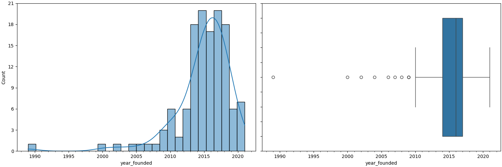
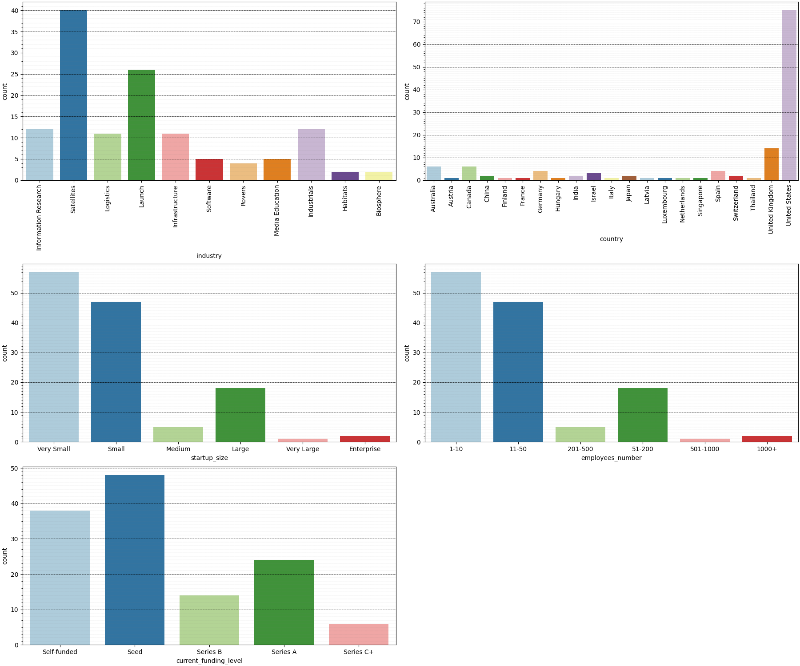
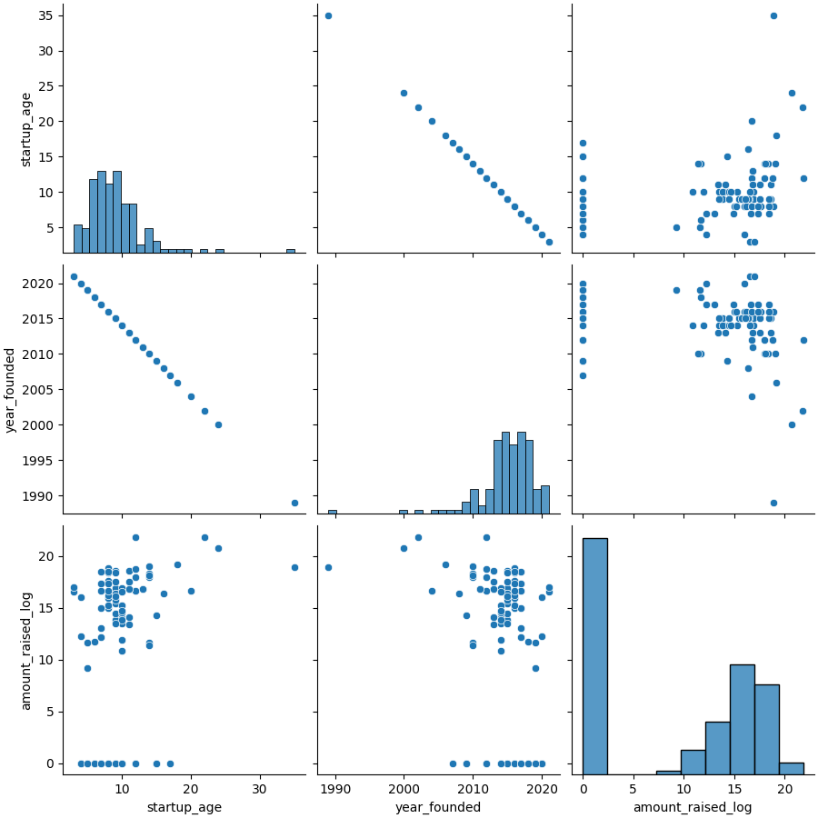
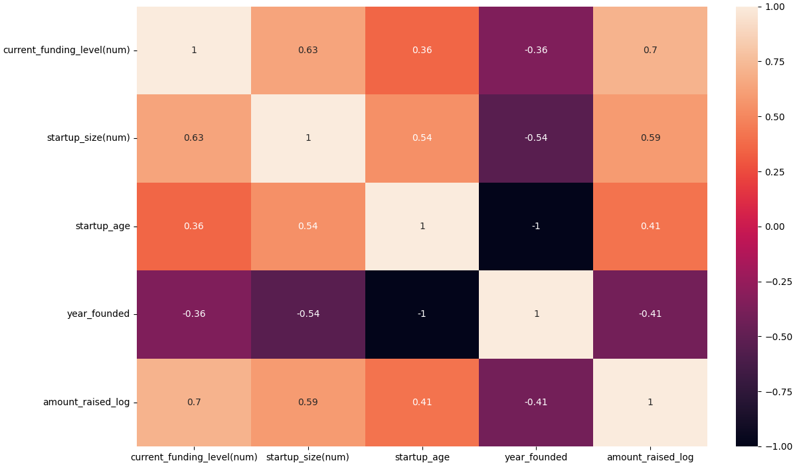
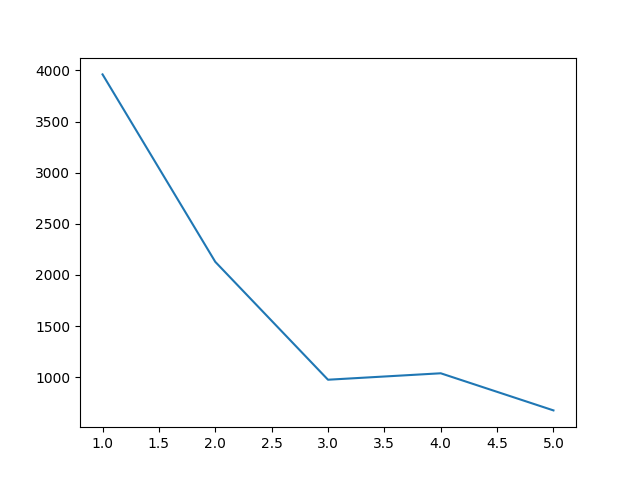
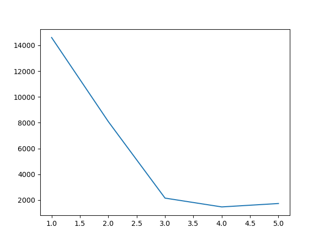
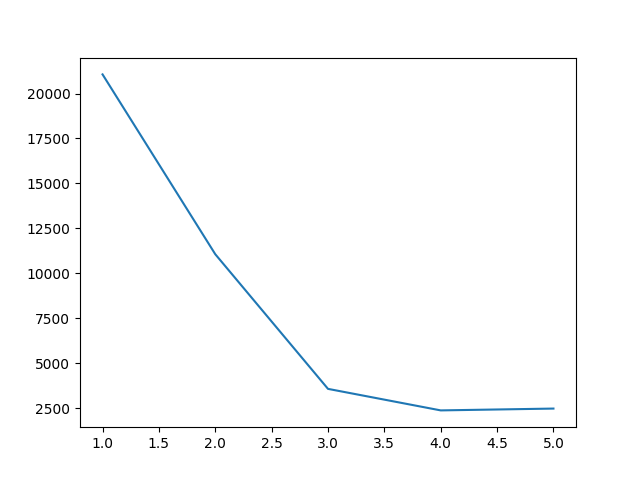
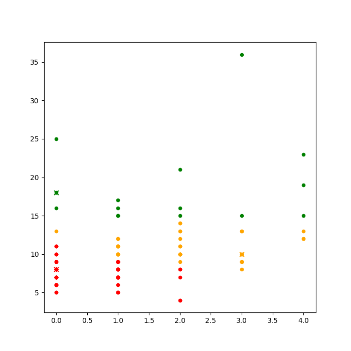
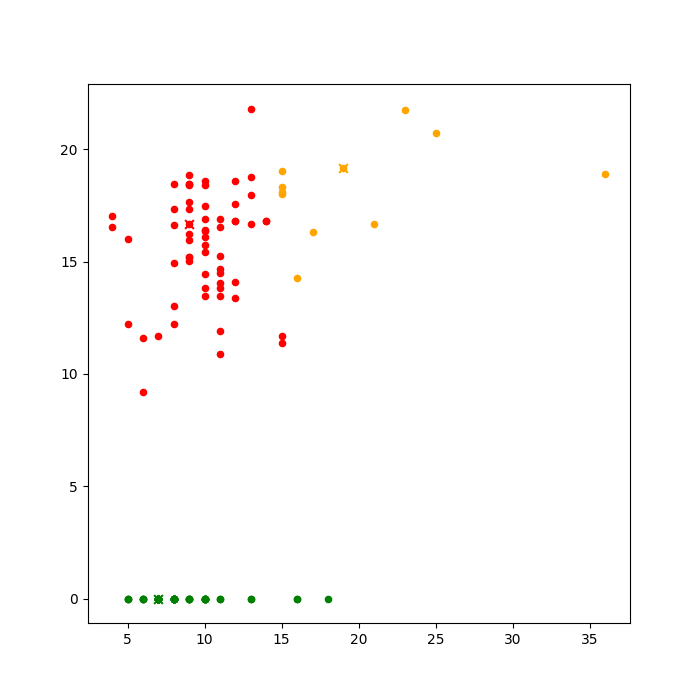
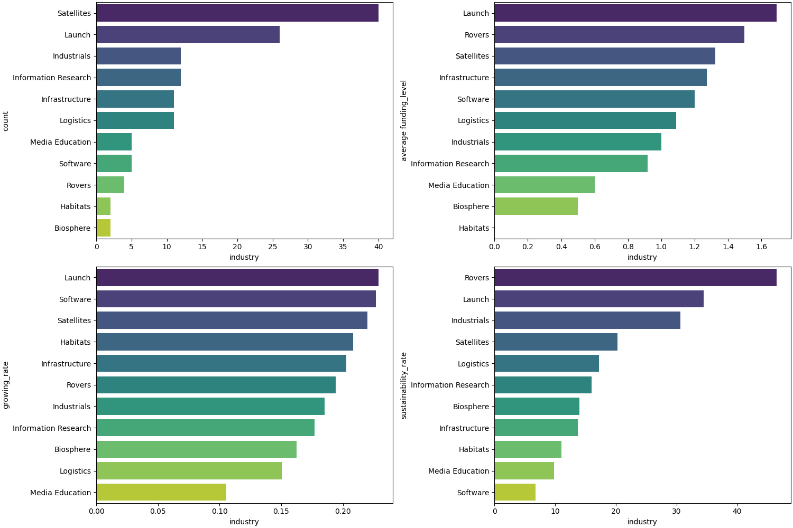

# INTRODUCTION

While I was surfing the Web, I faced with a quite catchy website, which looks pretty cozy at the same time. The website is a collection of today space startups and the information about them. So, I decided to use scrapping data tools to collect it for the future analysis.

The report immerses to an explanatory data analysis using different statistic methods. After that an additional analysis comes with implementing K-Means clustering on the data and extracting insights about space startups' countries and industires.

The project tasks were set:
1. Collect the data
2. Structure the data
3. Implement an explanatory data analysis
4. Implement KMeans clustering on the data
5. Extract additional insights.

The main tools are used:
- Python - programming language
- Requests - sending HTTP requests to interact with a website
- BeatifulSoap - scrapping data from webpages.
- Pandas - data manipulating and analysis
- Numpy - working with arrays.
- Matplotlib and Seaborn - visualizing
- VSCode - IDE
- Git - version control

I found it exciting to collect the space startups' information and make the data analysis to reveal insights in the area, where I have got few knowledge.

# RESEARCH

## 1. DATA
### 1.1. Data Description
The space startups data was collected from https://www.spacebandits.io/. The web site contains the basic information about startups:
- Startup name
- Country
- Industry
- Year founded
- Number of employees
- Current funding level
- Amount raised
- Startup description

All this information was collected while the data scrapping

### 1.2. Data Scrapping

For the data scrapping were used mostly BeatifulSoap and Requests libraries. 
The code is implemented only within a module [data scrapping](/implementation/data_scrapping/data_scrapping.py/). Tt consists of a main function and additional ones.

For checking implementation errors and flow is used logging library. Also, unittest were made for the functions - [data scrapping unittests](/tests/test_data_scrapping.py/)

The data was collected into a list of dictionaries and then converted to json file - [json data format](/assets/data/startups_data.json/)

## 2. ANALYSIS
## 2.1. Explanatory Data Analysis
### 2.1.1. Preliminary data explanation, manipulating and cleaning
The initial data had 130 rows and 7 columns.

After preliminary exploration turned out, that Industry column had null-value. It was the startups with name NewRocket. The website does not contain the startup industry information. According to the startup description the Launch industry was assigned.

The data contains unique:
- 11 industries - categorical
- 21 countries - categorical
- 20 year values - categorical
- 6 employees number categories - categorical
- 5 funding levels - categorical
- 70 raised amount values - numerical

In the next step the column names were changed or specified. The startups description column was excluded becauses no need in the main analysis. For some columns type was changed.

The new columns were created:
- startup_age - calculated from year founded
- startup_size - according to employees number categories:
    - 1-10 - Very Small
    - 11-50 - Small
    - 51-200 - Medium
    - 201-500 - Large
    - 501-1000 - Very Large
    - 1000+ - Enterprise

The space startups foundation years are within 1989 - 2021 year. The oldest one is 35 years old, the youngest - 3. The raised amounts are between 0 and 3 000 000 000 $. The average is 71,5 millions, but the standart deviation is 370 636 877, which is very big.

### 2.1.2. Univariate analysis

Further it is explored distribution and skew in the numerical data. To do this histograms and boxplots are created.

**Picture 1. Year founded data distribution and skewness.**

Space startups were started to be actively developed in around 2005 (Picture 1). Whereas the boom was in around 2013-2020.

**Picture 2. Startups age data distribution and skewness.**

Very few space startups are more than 15 years old (Picture 2). As a rule - 5-12 years old. The data is left skewed. There a few outliers, which are 20-35 years old.

_skew.png)
**Picture 3. Raised amounts (USD) data distribution and skewness.**

Overwhelming majority of space startups have zero raised amount, much less amounts are close to zero - 0-200 000 000 (Picture 3). There are a few outliers (3) with about 1 000 000 000 - 3 000 000 000 amounts raised.

The raised amount data distribution is normalized by converting to logarithms (Picture 4)

    
**Picture 4. Raised amounts log distribution**

For exploring the categorical data countplots are used (Picture 5).

**Picture 5. Univariate observation of categorical data**

Univariate categorical data analysis results are:

- The most active space startups industry is Sattelites - about 40. The next is Launch - about 26.
- USA is a leader in space startups - more than 70. The second place is occupied by UK - about 14.
- As a rule, there are very small and small size space startups with 1-10 and 10-20 employees. Also, there are more than 15 large startups with 51-200 employees. 
- Mainly, space startups are currently on Seed or Self-founded funding level. The every next funding level appears fewer times.

### 2.1.3. Bivariate analysis

To implement the bivariate analysis of the numerical data pairplot is used (Picture 6). Here is used the log normalized data of raised amounts.

    
**Picture 6. Bivariate observation of numerical data**

Startup age has a positive correlation with raised amount. Hence founding year has a negative correlation with raised amount.

Barplots are used to make the bivariate analysis of the categorical data (Picture 7). The numerical data is described in mean values here.

    
**Picture 7. Bivariate observation of categorical data**

On average:
- The oldest space startups industry is Rovers. Also, the biggest amounts are raised in Rovers. 
- Japan has the oldest space startups. 
- The top amounts are raised in China, Japan, and Finland according to the normalized amounts raised data. If we observ the inital raised amounts data in USD, then the leaders are USA, China and Japan. 
- The oldest startups and the biggest raised amounts are in size of enterprises (1000+ employees).
- Space startups on the Series C+ funding level are the oldest ones and have the biggest raised amounts.

### 2.1.4 Multivariate analysis

To implement the multivariate analysis the new columns are created - startup_size(num) (1-6) and current_funding_level(num) (0-4) (Table 1 & 2). The columns' values are converted to numerical data. 

**Table 1.** Converting size to numerical data.
| Size       | Numerical |
|------------|-----------|
| Very Small | 1         |
| Small      | 2         |
| Medium     | 3         |
| Large      | 4         |
| Very Large | 5         |
| Enterprise | 6         |

**Table 2.** Converting funding level to numberical data.
| Funding level | Numerical |
|---------------|-----------|
| Self-funded   | 1         |
| Seed          | 2         |
| Series A      | 3         |
| Series B      | 4         |
| Series C+     | 5         |

All the categorical data columns are dropped for the analysis. amount_raised(usd) is dropped as well, since it is used the log normilized version. For the multivariate analysys heatmap is used (Picture 7):

- Current funding level has a strong positive correlation to startup size (0.63) and raised amount (0.7). There is a moderate positive correlation to startup age (0.36)
- Startup size has a strong postivie correlation to startup age (0.54), raised amount (0.59) and current funding level (0.63).
- Startup age has a moderate positive correlation to raised amount (0.49) and current funding level (0.36)

    
**Picture 8. Multivariate obseravation, heatmap**

## 2.2. K-Means Clustering

K-Means clustering algortihm is implemented to find additional connections between the data.

It makes sense to use variables which have low correlation coeffiecient between. According to the multivariate analysis the next combination are made for K-Means clustering:

1. current funding level and startup age (correlation - 0.36)
2. startup age, raised amount (correlation - 0.41)
3. funding level (numerical) [1], startup age [2], raised amount (log)[3] (correlation -  1-2 -> 0.36, 1-3 -> 0.7, 2-3 -> 0.41)

### 2.2.1. Implemenetaiton

The K-Means clustering implementation is in [K-Means clustering implementation](/implementation/data_analysis/kmeans_implementation.py/). For the implementation the library sklearn is not used. It is created from the scratch to understand the algortihm concept. Mainly, there are used Pandas, NumPy and Matplotlib tools.

In the implementation file there is KMeans class, which contains all the main concepts of the algorithm:

- **Euclidean distance** - to calculate distance between points.
- **KMeans ++** algorithm - to initialize centroids correctly.
- Assigning data points to centroids.
- Calculating **inertia** - to measure how well clusters are created.
- Getting the best result - additional function to track the best algortihm results.

Also, there is an additional function - **Elbow Method**. It helps to find the optimal K values for the algorithm (Picutre 9, 10 & 11).

       
**Picture 9. Elbow method on combination 1.**

       
**Picture 10. Elbow method on combination 2.**

       
**Picture 11. Elbow method on combination 3.**

On average, for all the data combination for the K-Means clustering algortihm the Elbow method shows 3 as optimal K values.

### 2.2.2. Analisys and insights

The first combination does not show any significant relationship insights between current funding level (numerical) and startup age. Instead, it is primarily segregates startups based on their startup age (Picture 12).

       
**Picture 12. K-Menas clustering on combination 1.**

For the second combination (startup age, raised amount) the K-Means clustering algorithm idetifies three distinct clusters with recognizable patterns. Based on the visualization (Picture 13) these groups can be defined as:

1. Starups with no funds raised
2. Developing startups, that raised some funds
3. Developed startups, that raised some funds

Most developed space startups have secured some level of funding.

       
**Picture 13. K-Menas clustering on combination 2.**

The third combination of data - funding level, startup age and raised amount - have no remarkable relationship to analyze (Picture 14). The clusters here are segregated by raised amounts.

       
**Picture 14. K-Means clustering on combination 3.**

The K-Means clustering algorithm implmementation reveals one insight: **Most developed space startups have secured some level of funding.**

## 2.3. Additional Analysis

The additional analysis is implemented. The space startups countries and industries are observed deeper.

For the additional analysis are created additional columns:
- Growing rate - the startup size (numerical) and startup age ratio.
- Sustainability rate - the startup size (numerical) and startup age multiplication.

Growing rate reflects the speed of space startup developing. Sustainablity rate shows how sustainable space startup on the market now.

### 2.3.1. Questions

The next questions are analyzed:

1. What are the top space startups countries / industries? (count)
2. What are the average space startups funding levels in countries / industries?
3. What are the fastest growing space startups countries / industries?
4. What are the most sustainable space startups countries / industries?

### 2.3.2. Analysis and insights

The industries insights (Picture 16):

- The largest number of space startups is in the satellite industry. The second place is occupied by the space launch industry.
- Space launch startups have reached the highest funding levels on average commpared to other industries. The space rover industry takes second place in this regard.
- The space launch and the space software industries have the fastest growth. The satellite industry takes third place just after the space software industry.
- The space rover industry is the most sustainable. Additionaly, space launch, industrial and satellite startups are relatively sustainable.
- The space launch startups is a popular and fast-growing sector with high funding levels. Moreover, this industry has held out strongly in the market.

The industry statistics show a general trend toward early space exploration and reducing costs associated with it.

       
**Picture 16. Space startups industries.**

The countries insights (Picture 15):

- The largest number of startups is in the USA. The UK takes second place with a significant gap.
- China shows the fastest growth in space startups.
- Japan and China have the highest average funding levels. Finland ranks third in this regard.
- Japan is the most sustainable country for the space startups, with Finland showing almost the same results. China takes the third place here.

       
**Picture 15. Space startups countries.**

It is important to say:

- Japan has only two space startups - in rover and satellite industries.
- Finland - 1 in Satellites.
- China - 2 in Launch

The USA focuses mostly on satellites (23) and space launches (14). Also, there are 8 space infostructure startups in the USA. The UK focuses on space industrial (4) and launch (4) startups. There are 2 space media education startups in the UK.

### 2.3.3. Outliers

Raised amount outliers:
- OneWeb, Satellites, USA
- SpaceX, Launch, USA,
- Blue Origin, Launch, USA

Age outliers:
- Reaction Englines, Industrials, UK
- Ramon.Space, Satellites, USA
- Blue Origin, Launch, USA

# CONCLUSION
## 1. Analysys Conclusion

There are about 130 space startups around the world. The active space startups area developing starts approximately on 2010.  The space startups, that are developed well, have secured some level of funding. Generally, the statistics show the world' focus on satellites and space launches. Also, it reflects a general trend toward early space exploration and reducing costs assiciated with it.

## 2. What I learned

First thing to say, during this project I have developed my data scrapping skill. It opens a loads of opportunities for the future projects. In this project it has been my first time to implement the Machine Learning algorithm - K-Means clustering. Since I had decided to implement it from the scratch, it have given my a great boost in statistics. I increased my overall statistics skill in data analysis, applying different statistics methods and implementing the explanatory data analysis in an appropriate way. Indeed, I have gained deeper knowledge of the Python data analysis libraries - Pandas, NumPy, Matplotlib, Seaborn.

The project gaves a extremely valuable experience and lifts another level in data analytics. It encoureges me to take the next edges.